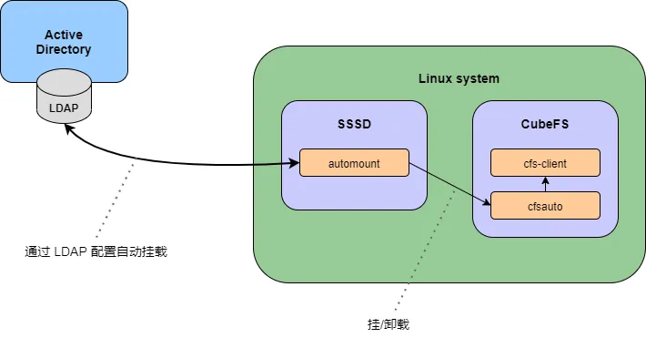
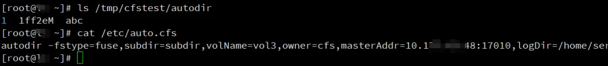
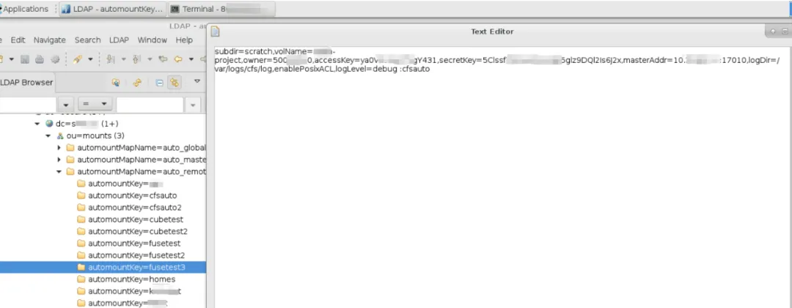
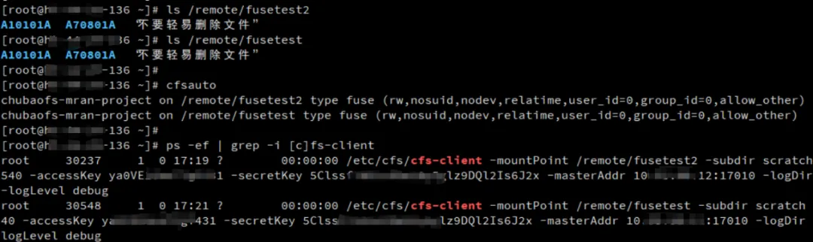

## Background

CubeFS [1] is a next-generation cloud-native storage product. It is currently an open-source project in the incubation phase hosted by the Cloud Native Computing Foundation (CNCF). CubeFS is compatible with multiple access protocols such as S3, POSIX, and HDFS. It supports multiple storage engines including multi-replica and erasure coding. CubeFS provides various features such as multi-tenancy, multi-AZ deployment, and cross-region replication, making it suitable for a wide range of use cases including big data, AI, container platforms, databases, middleware storage separation, data sharing, and data protection.

Autofs [2] is a program that automatically mounts specified directories on demand. It runs based on a kernel module for efficient performance and can manage both local directories and network shares. The automatically mounted points are only mounted when accessed and will be unmounted after a certain period of inactivity. This on-demand behavior saves bandwidth and achieves higher performance compared to statically mounted entries managed by /etc/fstab. While autofs is the control script, the actual command (daemon) responsible for the automatic mounting is automount.

This article focuses on CubeFS's support for mount, Autofs features, and their application in conjunction with surrounding ecosystems such as SSSD [3], and LDAP [4].

## Cfsauto

Cfsauto [5] program achieves CubeFS client-side file system mounting, Fuse file system mounting list display, and other functions by converting mount options into CubeFS parameters.



## deploy

### Installation
Example deployment based on the Master branch

```bash
wget https://github.com/cubefs/cubefs/archive/refs/heads/master.zip -O cubefs.zip
unzip -o cubefs.zip -d cubefs
cd cubefs/autofs
go build -v -ldflags="-X main.buildVersion=1.0.0" -o /usr/local/bin/cfsauto
```

### Environment Variables

CFS_CLIENT_PATH: Path to the cfs-client program, default is /etc/cfs/cfs-client

CFSAUTO_LOG_FILE: Path to the cfsauto log file, default is /var/log/cfsauto.log

##  Mount mounting example

### CubeFS Mount

Method 1: Mount using the mount command

mount -t fuse :cfsauto {mount point} -o {mount options}

```bash
mount -t fuse :cfsauto /home/cubetest3 -o subdir=subd,volName=project1,owner=123,accessKey=abc,secretKey=xyz,masterAddr=10.0.0.12:17010,logDir=/var/logs/cfs/log,enablePosixACL,logLevel=debug
```

Method 2: Mount using the cfsauto command

cfsauto {mount point} -o {mount options}

```bash
cfsauto /home/cubetest3 -o subdir=subd,volName=project1,owner=123,accessKey=abc,secretKey=xyz,masterAddr=10.0.0.12:17010,logDir=/var/logs/cfs/log,enablePosixACL,logLevel=debug
```

### CubeFS Mount List Display

```bash
# cfsauto
cubefs-vol3 on /home/cubetest3 type fuse.cubefs (rw,nosuid,nodev,relatime,user_id=0,group_id=0,allow_other)
```

## Autofs Configuration mounting example

The configuration file for autofs is /etc/auto.master, which specifies the root directory for automatic mounts and the location of the configuration file. When we access a subdirectory under this root directory, autofs will automatically mount the corresponding file system based on the configuration file.

### /etc/auto.master example:

```bash
/- /etc/auto.direct -ro,hard,intr,nolock 
# add /tmp/cfstest /etc/auto.cfs 

+auto_master
```

### /etc/auto.cfs example:

```bash
autodir -fstype=fuse,subdir=subdir,volName=vol3,owner=cfs,masterAddr=10.0.0.1:17010,logDir=/home/service/logauto,enablePosixACL,logLever=debug :cfsauto
```

### Autofs Debugging: automount -f --debug

Mounting Example:



## Integrated SSSD LDAP auto-mounting

### LDAP Configuration

LDAP automount module configures the mount point and CubeFS mount options.

automountkey configures the mount point, e.g., fusetest

automountInformation configures the CubeFS mount options as follows:

```bash
-fstype=fuse,subdir=subd,volName=project1,owner=123,accessKey=abc,secretKey=xyz,masterAddr=10.0.0.12:17010,logDir=/var/logs/cfs/log,enablePosixACL,logLevel=debug :cfsauto
```



### SSSD Configuration
Key configuration examples for the autofs module in SSSD:

```bash
autofs_provider      = ldap
ldap_autofs_search_base    = ou=mounts,dc=example,dc=com
ldap_autofs_map_master_name  = auto_master
ldap_autofs_map_object_class  = automountMap
ldap_autofs_entry_object_class  = automount
ldap_autofs_map_name    = automountMapName
ldap_autofs_entry_key    = automountKey
ldap_autofs_entry_value    = automountInformation
```

### Mounting Example



## Summary

This article introduces CubeFS's support for the automatic mounting feature by using deployment and configuration examples of the cfsauto tool. This provides CubeFS users with more free options in a variety of application scenarios.

## References

1. [CubeFS](https://www.cubefs.io)
 
2. [AutoFS](https://documentation.suse.com/zh-cn/sles/15-SP3/html/SLES-all/cha-autofs.html)

3. [SSSD](https://sssd.io/docs/introduction.html)

4. [LDAP](https://www.ibm.com/docs/en/zos/2.1.0?topic=SSLTBW_2.1.0/com.ibm.zos.v2r1.cbdu100/cbd2ug00152.html)

5. [CubeFS AutoFS](https://github.com/cubefs/cubefs/tree/master/autofs)
