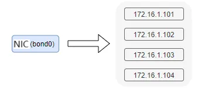
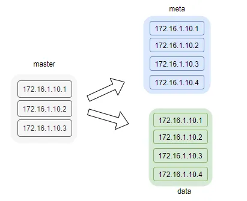
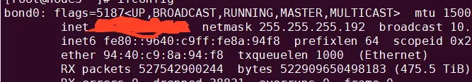

# CubeFS 10 Minutes Start - Single-node Deployment of CubeFS Cluster
Original by Xuewei Zeng, CubeFS, March 7, 2023, 20:00, Guangdong

## Author Introduction

Xuewei Zeng, one of the CubeFS Maintainers, responsible for the development of subsystems such as multi-replication and metadata management, currently working at OPPO.

## Preface

For new learners who want to quickly set up a CubeFS cluster to get started, the community currently provides two solutions:

- **Distributed deployment**, preparing at least 3 or more machines to build the cluster
- **Single-node deployment**, setting up a single-node docker cluster using Docker
- 
Both approaches have a certain level of complexity, so to further reduce the learning curve, this article introduces how to quickly set up a single-node CubeFS cluster without using Docker.

Note: This article describes the process using a 64-bit CentOS 7.6 system as an example, with the following manual deployment tutorial as reference.

Two methods are provided here to obtain binaries, direct download or manual compilation.

## Compilation

### 01 Binary Download

```bash

git clone https://github.com/cubefs/cubefs.git
cd ./cubefs
wget https://ocs-cn-north1.heytapcs.com/cubefs/bin/linux_centos_7_6_amd64.tar.gz
tar linux_centos_7_6_amd64.tar.gz

tree ./build/bin
build/bin/
├── cfs-cli
├── cfs-client
└── cfs-server
```
Note: Use `./build/bin/cfs-server -v` to check. If there is an error, you will need to compile the binaries manually.

### 02 Manual Compilation

Refer to the CubeFS manual deployment document compilation method

- Prepare the compilation environment
 
|Dependencies   |Version Requirement|
|--|--|
|gcc-c++        |4.8.5 and above|
|CMake          |3.1 and above|
|Go             |1.16 and above|
|bzip2-devel    |1.0.6 and above|

- First, download the latest module code from GitHub, for example, download it to a local directory

```bash
git clone https://github.com/cubefs/cubefs.git
```
- Enter the cubefs directory and execute compilation

```bash
cd ./cubefs
make server
make client
make cli
```

- Compiled binaries are located in the build/bin directory
  
## Deployment

- The deployment script creates four new IPs using network card aliases for service deployment


- Deployment service topology diagram as follows



- Execute the deployment script to start the cluster

* Require root permissions
* Able to use ifconfig
* Machine memory is above 4G
* The remaining space of the disk corresponding to /home/data is preferably above 20G

```bash
sh ./shell/depoly.sh /home/data bond0
```

/home/data: A directory on the local machine used to save cluster running logs and data, as well as default configuration files for each module

bond0: The name of the local machine's network card, as follows, needs to be filled in according to the local situation




- View cluster status  
Manage the cubefs cluster using the cfs-cli tool

```bash
./build/bin/cfs-cli cluster info
[Cluster]
Cluster name : cfs_dev
Master leader : 172.16.1.101:17010
Auto allocate : Enabled
MetaNode count : 4
MetaNode used : 0 GB
MetaNode total : 21 GB
DataNode count : 4
DataNode used : 191 GB
DataNode total : 369 GB
Volume count : 2
EbsAddr :
loadFactor : 0
BatchCount : 0
MarkDeleteRate : 0
DeleteWorkerSleepMs: 0
AutoRepairRate : 0
```

Note: Due to multiple data&meta nodes deployed on the same machine, the statistics of meta&data used and total are biased.

## Mount

- Create volume

```bash
./build/bin/cfs-cli volume create ltptest ltp
# View volume information
./build/bin/cfs-cli volume info ltptest
```
- Start the client
/home/data is the directory passed in when starting above


```bash
./build/bin/cfs-client -c /home/data/conf/client.conf
```

- df -h to check if the mount is successful

```bash
Filesystem      Size  Used Avail Use% Mounted on
udev            3.9G     0  3.9G   0% /dev
tmpfs           796M   82M  714M  11% /run
/dev/sda1        98G   48G   45G  52% /
tmpfs           3.9G   11M  3.9G   1% /dev/shm
tmpfs           5.0M  4.0K  5.0M   1% /run/lock
tmpfs           3.9G     0  3.9G   0% /sys/fs/cgroup
tmpfs           796M   84K  796M   1% /run/user/1000
cubefs-ltptest   10G     0   10G   0% /home/cfs/client/mnt
```

- `/home/cfs/client/mnt` is the mount point; its appearance indicates successful mounting.


```bash
cd /home/cfs/client/mnt
echo "hello cubefs" > hello.txt
cat hello.txt
```

- Unmount

```bash
umount /home/cfs/client/mnt
#Or force unmount
umount -l /home/cfs/client/mnt
```
## Stop cluster

- Stop the service

This will stop the server and cubefs mounts

```bash
sh ./shell/stop.sh
```

## Finally 

The above represents the successful establishment of the entire cluster and normal use.

The above installation tutorial is suitable for learners who want to get a preliminary understanding of CubeFS and for learners who want to further test performance, it is recommended to use the distributed deployment solution.